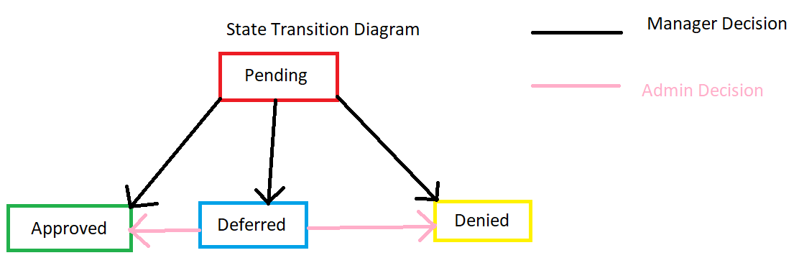

# Reimbursement Request Example
Consider making a reimbursement request: the request can have different "states" it exists in:
- pending
- approved
- denied
- deferred 

# Reimbursement Request Use Case
- Id: 1
- Name: Reimbursement Tracking
- Description: Employee should be able to track their reimbursement request status
- System: Workday
- Preconditions
    - request needs to be made
    - employee needs to have a designated Manager
    - manager needs to have a designated Admin
- Actors
    - Workday
    - Employee
    - Manager
    - Admin

# Testing considerations based upon given Use Case
- Is the request starting in the pending state?
- **Can a manager move a pending request into the "approved" state?**
- **Can a manager move a pending request into the "denied" state?**
- Are managers able to change the state of pending requests that are not from their designated employees?
- **Can an admin move a "deffered" request into the "approved" state?**
- **Can an admin move a "deferred" request into the "denied" state?**
- Can an employee see changes made to the reimbursement request?
- Is the system actually changing the state?
- Are admin able to view "deferred" requests?
- **Can managers move a pending request into the "deferred" state?**

# Create State Transition Diagram

# Create Scenarios
Once the data has been organized you start creating your scenarios

|Scenario| Step no |Actor | Description|
|--------|---------|------|------------|
|Positive Manager change "pending" to "accepted"|1|Manager|Manger selects "approved" for request status|
||2|Workday|Workday alerts manager request status was updated successfully|
||3|Manager|Manager can see request status is "approved"|
|Positive Manager change "pending" to "denied"|1|Manager|Manger selects "denied" for request status|
||2|Workday|Workday alerts manager request status was updated successfully|
||3|Manager|Manager can see request status is "denied"|
|...|...|...|...|
|Positive Admin change "deferred" to "accepted"|1|Admin|Admin selects "approved" status  for "deferred" request|
||2|Workday|Workday alerts admin request status was updated successfully|
||3|Admin|Admin can see request status is "approved"|

# Create Test Cases from Scenarios
Reminder of Test Case Content:
- Test Case Id
- Description
- Preconditions
- Test Data
- Steps
- Expected Outcome
- Actual Outcome
- Tester
- Status

|Use Case ID - Test Case Id|Description|Precondition|Test Data|Steps|Expected Outcome|Actual Outcome|Tester|Status|
|--------------------------|-----------|------------|---------|-----|----------------|--------------|------|------|
|1-1|Manager can change "pending" requests to "accepted"|1. request needs to be made 2. employee needs to have a designated Manager|"pending" request|1. Manger selects "approved" for request status 2. Workday alerts manager request status was updated successfully 3. Manager can see request status is "approved"|Manager can see the request has the "accepted" status|TBD|TBD|Untested|
